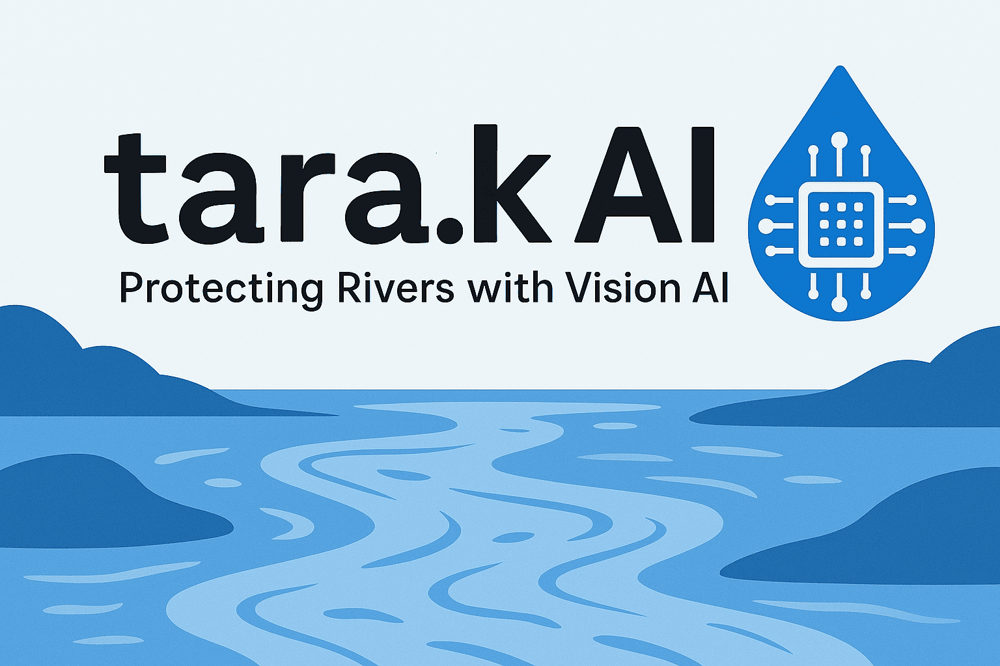

  

**"Tarak" (तारक)** in Sanskrit means *Savior* or *Protector*, and **AI** represents the Artificial Intelligence core of this project. **tarak.AI** is an interactive web application designed to tackle the problem of unreported river pollution by empowering the public to participate in environmental monitoring.

---

## 🧠 Project Overview

**tarak.AI** allows users to report river pollution in real time, primarily by uploading images. These images are processed by the **InstructBLIP Vision-Language Model**, which helps in:

- Determining the severity of pollution
- Identifying and classifying visible pollutants

Additional features include( some to be Integrated in future):

- Manual or automated (via EXIF data) location tagging
- Generation of pollution reports for public research
- Local and searchable air/water pollution statistics (Google Maps API integration)
- Government initiatives displayed in a dynamic slideshow format
- **Multi-language support** (via Bhashini integration) for inclusivity across Indian communities

---

## ⚠️ Current Challenges

- **Deployment:** Handling model dependencies and real-time performance
- **Image Processing Workflow:** InstructBLIP is computationally intensive  
- **Model Integration:**  
  - Beginner approach: Use pre-trained InstructBLIP  
  - Learning goal: Fine-tune the model using datasets like **TACO**, with guidance from the SLCR team

---

## 🚀 Future Enhancements

- Creation of a mobile app with all core features and a social media-like interface
- Integration of government APIs for real-time data and program insights
- Fine Tuning the model
- Backend Database Integration
- Gamification/Rewarding System

---

## 📁 GitHub Repository

🔗 [tarak.AI GitHub Repo](https://github.com/Atharwaaah/tarak.AI.git)
🔗 [Live Demo]- https://atharwaaah.github.io/tarak.AI

---
---

## 🛠️ Setup Instructions

This project currently runs through a Google Colab notebook. Follow the steps below to get started:

### 1. Open the Colab Notebook
- Visit the notebook: [🔗 tarak.AI Colab](https://colab.research.google.com/drive/1ZYc8_cIhDaZMRsGxP-fP8HewPb_ZtOsd?usp=sharing)
- Click **"Open in Colab"** (or manually upload to Colab)

### 2. Run All Cells
- Ensure GPU runtime is enabled:  
  Go to `Runtime` > `Change runtime type` > Select **GPU**
- Click `Runtime` > `Run all` to execute the notebook

### 3. Upload Images
- Use the provided upload cell to submit river pollution images
- The notebook will process them using the **InstructBLIP Vision-Language Model** and provide output on severity and pollutant type

---

## ✅ Requirements (For Local Setup)

If running locally (optional), ensure the following:

- Python 3.8+
- pip
- Jupyter or VS Code
- Required libraries (install via `pip install -r requirements.txt`)

---

## 👤 Author

**Atharva Sachin Gupta**  
`22024006`, 3rd Year - IDD Biomedical Engineering  
✉️ atharva.gupta.bme22@iitbhu.ac.in
